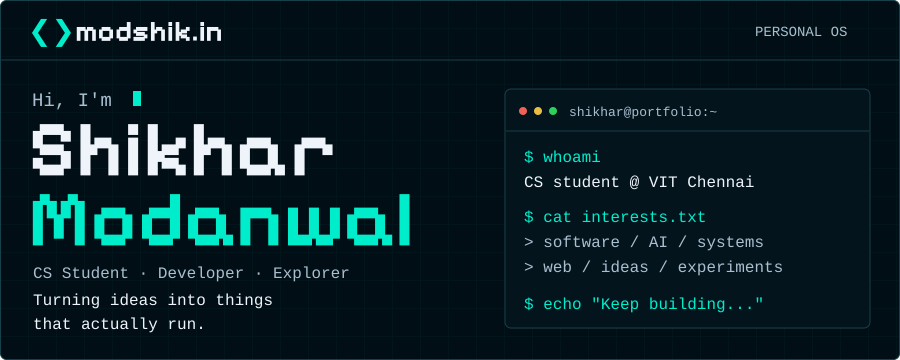
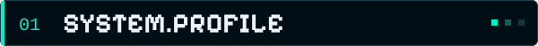
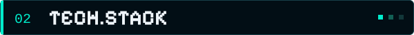
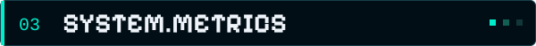
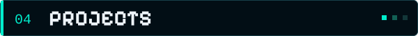
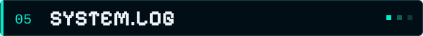
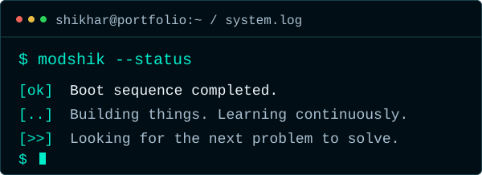
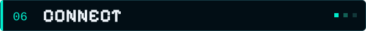
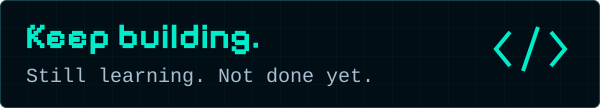

  

  
  &nbsp;&nbsp;
  

 

<table>
  <tr>
    <td valign="top" width="50%">
      <code>ABOUT_ME</code>
        
      Hi, I'm <b>Shikhar</b>.
        
      Computer Science student interested in building software, experimenting with AI and systems, and turning ideas into working products.
        
      <b>LOCATION</b>&nbsp;&nbsp;·&nbsp;&nbsp;India
       
      <b>FOCUS</b>&nbsp;&nbsp;·&nbsp;&nbsp;Software / AI / Systems / Web
    </td>
    <td valign="top" width="50%">
      <code>CURRENTLY</code>
        
      <b>▸&nbsp;&nbsp;BUILDING</b>
       
      Personal projects and experimental ideas
        
      <b>▸&nbsp;&nbsp;LEARNING</b>
       
      Software engineering, AI and systems
        
      <b>▸&nbsp;&nbsp;EXPLORING</b>
       
      New technologies and real-world problems
    </td>
  </tr>
</table>

 

   
  <code>LANGUAGES</code>
    
  
     
  <code>DEVELOPMENT</code>
    
  
     
  <code>EXPLORING</code>
    
  
    
  Technologies I build with, learn from, or am actively exploring — not a claim of expertise.

 

<table>
  <tr>
    <td width="50%"></td>
    <td width="50%"></td>
  </tr>
  <tr>
    <td colspan="2" align="center"></td>
  </tr>
</table>

 

<table>
  <tr>
    <td valign="top" width="50%">
      <code>PROJECT_01</code>
        
      <b><a href="https://modshik.in">modShik.in</a></b>
       
      My personal portfolio and digital space.
        
      
    </td>
    <td valign="top" width="50%">
      <code>PROJECT_02</code>
        
      <b>SAS // Integrated AI Edge OS</b>
       
      An experimental concept focused on an integrated AI-powered edge operating system and intelligent local computing.
        
      
    </td>
  </tr>
  <tr>
    <td colspan="2" align="center">MORE PROJECTS COMING SOON &nbsp;·&nbsp;·&nbsp;·</td>
  </tr>
</table>

 

 
 

   
  <code>PORTFOLIO</code>&nbsp;&nbsp;·&nbsp;&nbsp;<a href="https://modshik.in">modshik.in</a>
    
  <code>GITHUB</code>&nbsp;&nbsp;·&nbsp;&nbsp;<a href="https://github.com/modShik">github.com/modShik</a>
    
  Open to collaboration on interesting problems.

 

  
    
  

