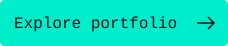
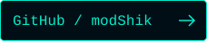

  <picture>
    <source media="(max-width: 600px)" srcset="assets/banner-mobile.svg">
    
  </picture>

  
  

 

<h2></h2>

<table>
  <tr>
    <td valign="top" width="50%">
      <code>ABOUT_ME</code>
        
      Hi, I'm <b>Shikhar</b>.
        
      Computer Science student at <b>VIT Chennai</b>, interested in building software, experimenting with AI and systems, and turning ideas into working products.
        
      <b>LOCATION</b> · Chennai, India
       
      <b>FOCUS</b> · Software / AI / Systems / Web
    </td>
    <td valign="top" width="50%">
      <code>CURRENTLY</code>
        
      <b>▸ BUILDING</b>
       
      Personal projects and experimental ideas
        
      <b>▸ LEARNING</b>
       
      Software engineering, AI and systems
        
      <b>▸ EXPLORING</b>
       
      New technologies and real-world problems
    </td>
  </tr>
</table>

 

<h2></h2>

  
<code>LANGUAGES</code>

  
    
  
<code>DEVELOPMENT</code>

  
    
  
<code>EXPLORING</code>

  
  
Technologies I build with, learn from, or am actively exploring — not a claim of expertise.

 

<h2></h2>

  
  
Public GitHub activity · Automatically updated by Streak Stats

  
<a href="https://github.com/modShik?tab=overview">GitHub activity ↗</a> &nbsp;·&nbsp; <a href="https://leetcode.com/u/modShik/">LeetCode ↗</a> &nbsp;·&nbsp; <a href="https://codeforces.com/profile/modShik">Codeforces ↗</a>

 

<h2></h2>

<table>
  <tr>
    <td valign="top" width="50%">
      <code>PROJECT_01</code>
        
      <b><a href="https://modshik.in">modshik.in ↗</a></b>
        
      My personal portfolio and digital space. A terminal-inspired interface with another way to explore: Snake Mode.
        
      React · Vite · Tailwind CSS
        
      <code>● LIVE</code>
    </td>
    <td valign="top" width="50%">
      <code>PROJECT_02</code>
        
      <b><a href="https://github.com/modShik/SAS">SAS ↗</a> // Integrated AI Edge OS</b>
        
      An experimental concept focused on an integrated AI-powered edge operating system and intelligent local computing.
        
      Systems · Edge computing · AI exploration
        
      <code>▸ BUILDING</code>
    </td>
  </tr>
  <tr>
    <td colspan="2" align="center">MORE PROJECTS COMING SOON &nbsp;·&nbsp; <a href="https://modshik.in/#projects">Explore all portfolio projects →</a></td>
  </tr>
</table>

 

<h2></h2>

<picture>
  <source media="(max-width: 600px)" srcset="assets/system-log-mobile.svg">
  
</picture>

  

<h2></h2>

  <a href="https://modshik.in">Portfolio ↗</a> &nbsp;·&nbsp;
  <a href="https://github.com/modShik">GitHub ↗</a> &nbsp;·&nbsp;
  <a href="https://www.linkedin.com/in/modshik/">LinkedIn ↗</a> &nbsp;·&nbsp;
  <a href="mailto:modanwalshikhar2004@gmail.com">Email ↗</a>

Open to collaboration on interesting problems.

 

  
    
  

